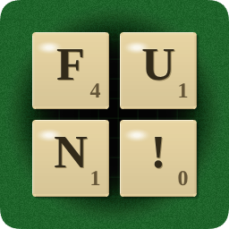
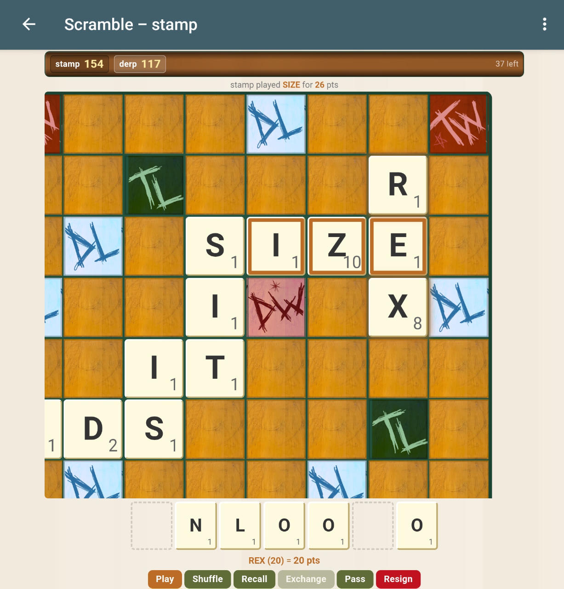

# Scramble - A 2-player webxdc letter tile word game
<p align="center">
    
</p>
The code for this project was made with Claude and is a simple webxdc game for 2 players.  Tile art by Gruel <3.

<p align="center">
    
</p>

## building
To build, simply run 
```bash
npm run build
```
and you'll have a new dist/scramble.xdc to try.