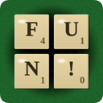
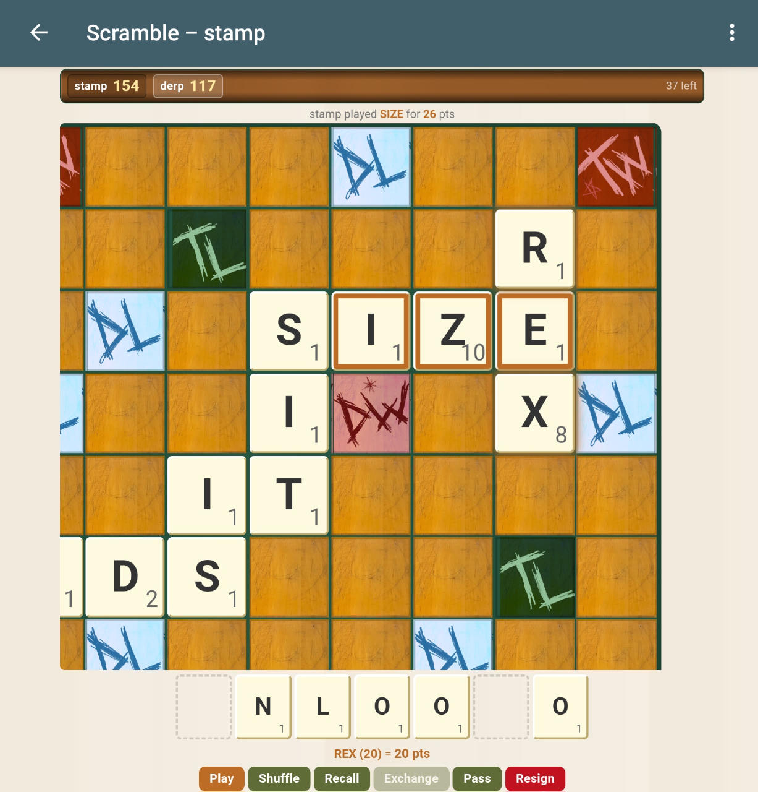

# Scramble - A 2-4 player webxdc letter tile word game
<p align="center">
    
</p>
The code for this project was made with Claude and is a webxdc word game for 2 to 4 players. One Scramble message in a chat holds any number of games: open the home menu to create a game, join one, or watch.  Tile art by Gruel <3.

<p align="center">
    
</p>

## building
To build, simply run 
```bash
npm run build
```
and you'll have a new dist/scramble.xdc to try.

## developing
```bash
npm run dev   # each browser tab is a separate player (use "Add Peer")
npm test      # reducer tests
```
